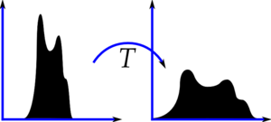
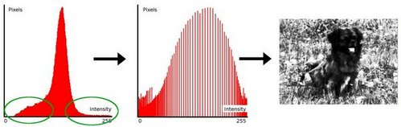

# Napadi:

### 1. Contrast stretch
```imadjust(im)```\
\
https://docs.opencv.org/3.1.0/d5/daf/tutorial_py_histogram_equalization.html
### 2. Histogram equalization
```histeq(im)```\
\
https://docs.opencv.org/3.4/d4/d1b/tutorial_histogram_equalization.html
### 3. Drop least significant bits
```4*(im/4)```
### 4. Enlarge/shrink
```imresize(imresize(im,1.3),[m,n])```
### 5. Shrink/Enlarge
```imresize(imresize(im,.5),[m,n])```
### 6. Crop/resize
```imresize(im(5:end-5,5:end-5),[m,n])```
### 7. Low noise
```imnoise(im, 'gaussian', 0, 0.001)```
### 8. Heavy noise
```imnoise(im, 'gaussian', 0, 0.05)```
### 9. Moderate JPG compression
```imwrite(im, 'temp.jpg', 'quality', 50)```
### 10. High JPG compression
```imwrite(im, 'temp.jpg', 'quality', 25)```
### 11. Razvodnjavanje ziga
### 12. Mala rotacija