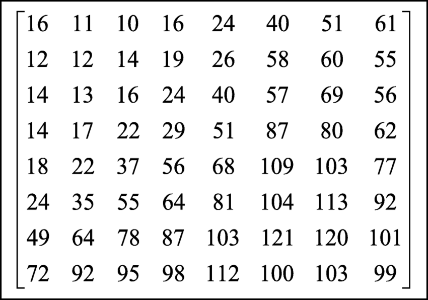

## Znimljivi linkovi 
- DIP Lecture 21: Digital watermarking: https://www.youtube.com/watch?v=O2RwWHWHQlM&t=3105s\
- Frequency Coefficient: https://www.sciencedirect.com/topics/computer-science/frequency-coefficient\
- Discrete cosine transform: https://en.wikipedia.org/wiki/Discrete_cosine_transform\
- JPEG DCT, Discrete Cosine Transform (JPEG Pt2)- Computerphile: https://www.youtube.com/watch?v=Q2aEzeMDHMA\
- QR Code Watermarking for Digital Images: https://ro.uow.edu.au/cgi/viewcontent.cgi?article=4752&context=eispapers1\
- A QR Code Watermarking Approach Based on the DWT-DCT Technique: https://www.researchgate.net/publication/318136736_A_QR_Code_Watermarking_Approach_Based_on_the_DWT-DCT_Technique
-  A Comprehensive Review on Digital Image Watermarking: https://arxiv.org/abs/2207.06909
- Patchwork: http://www.lia.deis.unibo.it/Courses/RetiDiCalcolatori/Progetti98/Fortini/patchwork.html\
- Digital Image Watermarking Techniques: A Review: https://www.mdpi.com/2078-2489/11/2/110
- Identifying AI-generated images with SynthID: https://deepmind.google/discover/blog/identifying-ai-generated-images-with-synthid/
- Researchers Tested AI Watermarks - and Broke All of Them: https://www.wired.com/story/artificial-intelligence-watermarking-issues/
https://ieeexplore.ieee.org/stamp/stamp.jsp?tp=&arnumber=8221092
## Ciljevi vodenog ziga:
- vizualna neprimetnost
- statisticka neprimetnost
- otpornost na namerne i nenamerne napade:
    - secenje ivica
    - promena dimenzija
    - kompresija
    - poboljsanje kvaliteta
    - rotacija
    - ostampaj -> skeniraj
    - dodavanje suma
    - dodavanje teksta na sliku
- mogucnost detekcije promenjene slike
- veliki kapacitet
- brzo kodiranje i dekodiranje
- u zavisnosti od primene, dekodiranjem zelimo da procitamo informacije ili zelimo da proverimo nivo podudaranja sa unapred poznatom originalnom slikom i informacijom upisanom u zig

## Vodeni zigovi u prostornom domenu

### Upisivanje ziga u manje znacajne bitove slike
MarkedImg = (Img // 4)*4 + 2bitWatermark\
Ukoliko promenimo poslednja dva bita svake boje, slika obicno se obicno subjektivno ne promeni. U ta dva bita po pikselu mozemo da upismeo nas watermark.
- Ovom metodom mozemo da postignemo vizualnu neprimetnost
- Zig je osetljiv na bilo kakve pormene na slici
- Lako se detektuje, otklanja i menja
### Kodiranje pseudo slucajanim sumom
- podelimo sliku na blokove istih dimenzija
- definisemo dva paterna suma w0 i w1 koji su istih dimenzija kao blokovi
- U svaki blok mozemo da umisemo jedanbit k, blok sabiramo sa w0 kako upisali 0, odnosno w1 kako bismo upisali 1
- Dekodiranje
    - ponovo podelimo sliku na iste blokove
    - radimo koorelaciju svakog bloka sa sumom w0 i w1 i odredjujemo bit k na osnovu vece koorelacije
- Ova metoda je otporna na jednostavnije transformacije poput promene kontrasta
- Zig je osetljiv na svaku promeni dimenzija 

### Patchwork
Dva seta piksela sike se biraju, A i B. Algoritam pomalo posvetli piksele iz seta A dok za isti faktor pomalo potamni piksele iz seta B. Podela se vrsi pseudo slucajno gde i posaljilac i primalaz znaju seme.

## Vodeni zigovi u frekventnom domenu

Glavna ideja: sakriti informacije u vizuelno bitnim frekventnim opsezima. Ovo na prvu zvuci paradoksalno, s obzirom da sakrivanje informacija u manje bitnim frekvencijama bi zig ucinilo manje primetnim, ali time zig ne bi bio otporan na transformacije poput kompresije kojima za cilj imaju da zadrze sve vizuelno bitne osobine. 

### Frequency-flipping
Slicno kao za kodiranje pseudo slucajnim sumom, podelicemo sliku na blokove 8x8 i u svaki blok cemo pokusati da upisemo jedan bit. 

Uzmemo dva DCT koeficijenta koji za koje se ocekuje da imaju slicne opsege vrednosti. Koeficijente mozemo da izabrati iz JPEG 50 matrice za normalizaciju, na primer N(4,1) i N(2,3) koji oba imaju koeficijent 14. Zatim, za svaki 8x8 blok izracunamo DCT C(u,v).

- C(4,1) >= C(2,3) -> tumacimo kao bit 0
- C(4,1) < C(2,3) -> tumacimo kao bit 1\

Ukoliko se vrednost bita za dato polje razlikuje od onoga sto u njega zelimo da upisemo, zamenicemo ih

- Ova metoda je otporna na vecinu laksih transformacija, pa cak i kompresiju
- Ukoliko napadac zna da je koriscen ovaj vodeni zig, moze potpuno da ga otkloni tako sto nasumicno zameni C(4,1) i C(2,3)

### Robusnije resenje (Cox et al)

- Izracunamo DCT za celu sliku
- Nadjemo K najjacih koeficijenata c1..ck (bez DC koeficijenta)
- Vodeni zig ce biti K-bitni random vektor, w1..wk, gde je wi ~ N(0,1)\
    ci' =ci*(1 + alpha*wi), alpha>0 - jacina vodenog ziga
- Zamenimo ci sa ci' i uradimo iDCT
- Dekodiranje
  - Izracunamo DCT slike
  - Izvucemo K koeficijente sa poznatih lokacija (moramo da znamo sa koji koeficijentima smo kodirali)
    c1"..ck"
  - wi" = ((ci"/ci) -1) / alpha (moramo da imamo originalnu sliku i alpha)
  - izracunamo (w"*w/sqrt(w"*w")) = sim(w",w) <- ocekivanje je da bude normalno distribuirano, ako je sim>6, slucajna promenjljiva je 6 standardnih divijacija od srednje vrednosti

### Vodeni zig sa QR kodom
Moguce je iskoristiti prednosti QR kodova kao što su ispravke grešaka i visok kapacitet podataka kako bi se u sliku upisale dodatne informacije